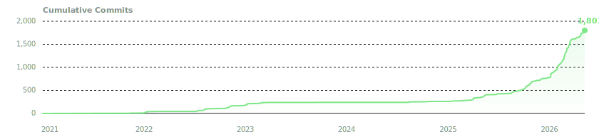

# Hunter Fleischhacker

`solana engineer @ anonmesh · mobile + arcium · anchorage, AK · 61°N`

[](https://epicexcelsior.com)
[](https://x.com/anon0mesh)
[](https://x.com/excelhtf)
[](https://linkedin.com/in/htfleischhacker)
[](https://epicexcelsior.com/resume)

---

<a href="https://github.com/epicexcelsior">
  
</a>

<a href="https://raw.githubusercontent.com/epicexcelsior/epicexcelsior/main/commits-graph.svg">
  
</a>

---

### Currently

Engineering at **[anonmesh](https://x.com/anon0mesh)** — Solana mobile (Android + iOS via React Native), Arcium integration for encrypted compute, and content/BD on the side. Not actively looking, but open to good flexible, contract, or future-dated work — best path is `htfleischhacker@alaska.edu` or [a meeting](https://epicexcelsior.com/meet).

### Shipped

**[Monolith](https://github.com/epicexcelsior/monolith)** — Mobile 3D DeFi game on Solana. Players staked USDC to claim blocks in a shared tower; every block was a real position. Custom GLSL shaders, 650 instanced blocks at 60fps on mobile, Anchor on-chain, 320+ tests across mobile/server/on-chain. Shipped 2025.

`TypeScript` `React Native` `Three.js` `Anchor/Rust` `Colyseus` `Supabase` `MWA` `SOAR` `Tapestry`

**[Pls Give](https://plsgive.com)** — Real-time 3D multiplayer donation game on Solana. Wallet auth, on-chain donations, VFX scaled with how much you sent. Won the **OnionDAO Hackathon**, earned a **Solana Breakpoint travel grant** to Abu Dhabi, and the **mtnDAO Builder Residency**.

`PlayCanvas` `Colyseus` `Solana` `Helius` `Supabase` `Cloudflare Workers`

**[Seeker Eats](https://seekereats.app)** — Pay for food with USDC on Solana Mobile; DoorDash drives it, merchant gets fiat at the edge. **3rd place — Solana Track**, 2025 Midwest Blockchain Conference Student Hackathon.

`React Native` `Solana` `Privy` `DoorDash Drive API` `Twilio`

**[Become](https://github.com/Mechwarrior727/nextjs-capstone)** — Habit tracking with USDC on the line. Miss your goal and your stake redistributes to peers who hit theirs. Senior capstone — PDA escrow, Google Fit oracle, team of three.

`Next.js` `Anchor` `Privy` `Supabase` `Google Fit API`

---

### Tech Stack

```
Languages     TypeScript · Rust (Anchor) · GLSL · Python · C/C++ · SQL
Frontend      React · React Native + Expo · Next.js · Astro · Three.js / R3F · Tailwind
Backend       Node.js · Cloudflare Workers · Supabase · Colyseus · Docker
Solana        Anchor · Arcium · Solana Mobile Wallet Adapter · Helius · @solana/kit · Privy
```

---

### Timeline

- **2026 –** Engineer @ **anonmesh** — Solana mobile + Arcium
- **Feb 2026** — mtnDAO Solana Builder Residency (Monolith)
- **Dec 2025** — B.S. Computer Science, University of Alaska Anchorage
- **Dec 2025** — Breakpoint Travel Grant (College.xyz + MBC)
- **Nov 2025** — 3rd Place Solana Track, MBC Hackathon (Seeker Eats)
- **Aug 2025** — mtnDAO Solana Builder Residency (Pls Give)
- **Jun 2025** — OnionDAO Hackathon Winner (Pls Give)
- Eagle Scout · Stand With Crypto Alaska Chapter President · German C1

<!--
================================================================
GitHub-side polish that can NOT be done via README edits.
Run these manually in the GitHub UI:

[ ] Settings → Public profile → Name: change "Excelsior epicexcelsior 👨‍🍳" to "Hunter Fleischhacker"
[ ] Settings → Public profile → remove the chef emoji from the name
[ ] Settings → Public profile → Bio: set to:
        solana dev · engineer @anon0mesh · mobile, arcium, content · anchorage 61°N
[ ] Profile page → Customize your pins → pin these 6 repos in order:
        1. monolith              (existing, public, has description)
        2. anon0mesh             (existing, public — your anonmesh contribution surface)
        3. epicexcelsior         (this profile README repo — itself a portfolio piece)
        4. seeker-landing        (Seeker Eats landing — public)
        5. agentic-ui            (recent public OSS-y experiment, good signal)
        6. grid-sdk-cli          (Squads Grid SDK CLI — bite-sized OSS contribution)
    Pinning these pushes the old Discord-bot forks and pg-frontend out of "Popular repositories"
    so the first impression matches the work below.

[ ] If anonmesh has a GitHub org, ask to appear as a public member — recruiter-visible social proof.
================================================================
-->
